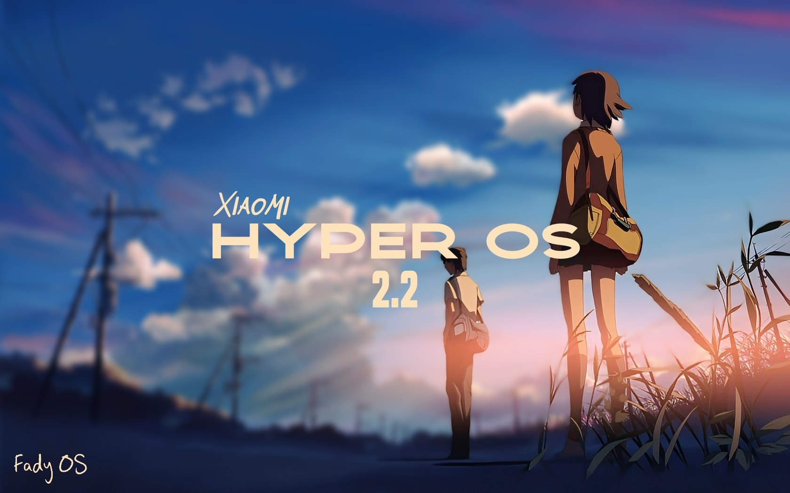

# FadyOS
FadyOS port for POCO X3 PRO (vayu)

## Info
- **FadyOS**
- V2.0.214.0
- Port from POCO F3
- Android 15
- Updated: **28/08/25**
- Port by: [**xendr4x** (Project Eliminator)](https://t.me/project_eliminator)

## Download
### V6 FIX (Recommended)
- [Gofile](https://gofile.io/d/Wzyc03)
- [PixelDrain](https://pixeldrain.com/u/AKZpZXqR)
- [BuzzHeaver](https://buzzheavier.com/x51vpdr91bwc)
- [Google Drive](https://buzzheavier.com/x51vpdr91bwc)
### V6
- [PixelDrain](https://pixeldrain.com/u/ZH5TF6ef) (3.17GB)

## ChangeLog
### V6 Fix
- Added 130Hz
- New refresh rate menu
- Fixed SIM Card bug (SystemUI Crashing)

## Bugs
- 60FPS After reboot
- Camera app is bad, should install gcam

## Notes
- OSS based
- GMS Included
- SELinux: Enforcing
- Play integrity: ?
- Bugs: if you found bugs, write bugs to [support group](https://t.me/pe_support)

## Contacts
- [Support Group](https://t.me/pe_support)
- [Channel](https://t.me/project_eliminator)
