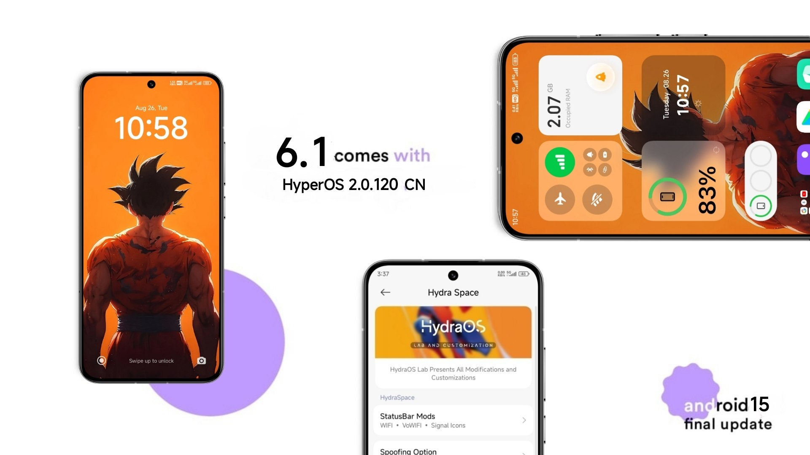

# HydraOS Quantum
HydraOS Quantum port for POCO X3 PRO (vayu)

## Info
- **HydraOS Quantum**
- V2.0.120.0
- Port from POCO X5 Pro 5G
- Android 15
- Updated: **29/08/25**
- Port by: [**xendr4x** (Project Eliminator)](https://t.me/project_eliminator)

## Download
### HydraOS Quantum
- [BuzzHeaver](https://buzzheavier.com/zls2ihpgqwbf)
- [Gofile](https://cold-eu-agl-1.gofile.io/download/web/f4a4bb87-db7f-4d89-8a57-66de47babf85/HydraOS-6.1_OS2.0.120.0_CN_PORT_vayu.zip)

## Bugs
- 60FPS After reboot
- Camera app is bad, should install gcam

## Notes
- OSS based
- GMS Included
- SELinux: Enforcing
- Play integrity: Pass (not strong)
- Bugs: if you found bugs, write bugs to [support group](https://t.me/pe_support)

## Contacts
- [Support Group](https://t.me/pe_support)
- [Channel](https://t.me/project_eliminator)
