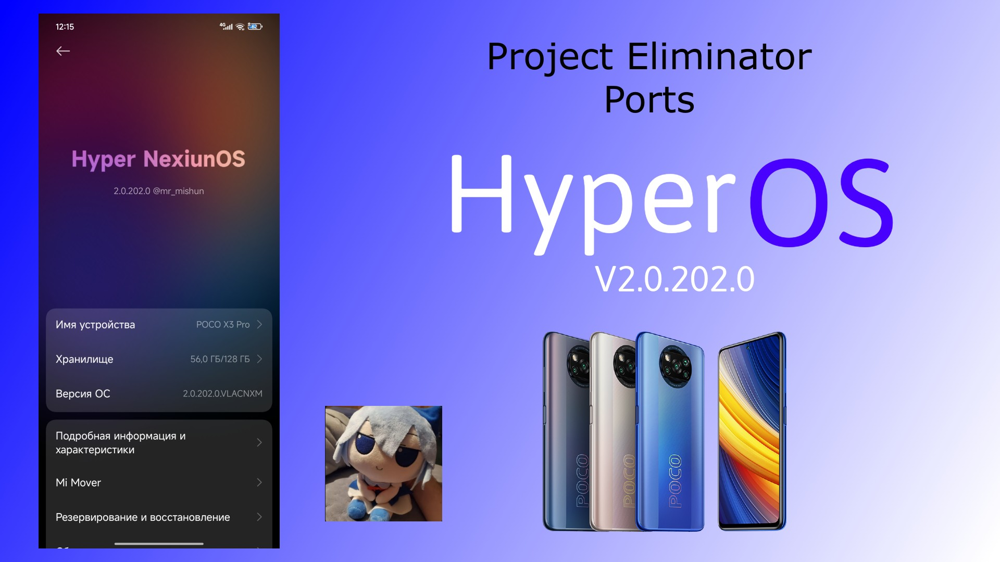

# Hyper NexiunOS
Hyper NexiunOS port for POCO X3 PRO (vayu)

## Info
- **Hyper NexiunOS**
- V2.0.202.0
- Port from [POCO F3](https://t.me/pocoF3GlobalUpdates/2650)
- Android 15
- Updated: **20/08/25**
- Port by: [**xendr4x** (Project Eliminator)](https://t.me/project_eliminator)

## V2 ChangeLog
- Changed author (from @mr_mishun to @project_eliminator)
- Included CorePatch
- Replaced launcher to mod by @kakashi1v1
- QuickSettings like ColorOS
- Extented power menu

## Download
### V1
- [PixelDrain (V1)](https://pixeldrain.com/u/GMDBC6CM) (3.17GB)
### V2
- [Google Drive (V2)](https://drive.google.com/file/d/1GJEIi9PBYzixh0ZIo-8c34OJ07oLEZWz/view?usp=sharing)
### Info
- **You can update use OTA**
- V2 is latest for now

## Bugs
- 60FPS After reboot
- Advanced textures not normal works ([fix for v1](https://t.me/pe_support/66), [fix for v2](https://t.me/pe_support/104))

## Notes
- OSS based
- GMS Included
- SELinux: Enforcing
- Play integrity: [Guide](https://t.me/HyperAliothPort/20)
- Port from [POCO F3](https://t.me/pocoF3GlobalUpdates/2650)
- Bugs: if you found bugs, write bugs to [support group](https://t.me/pe_support)

## Contacts
- [Support Group](https://t.me/pe_support)
- [Channel](https://t.me/project_eliminator)
