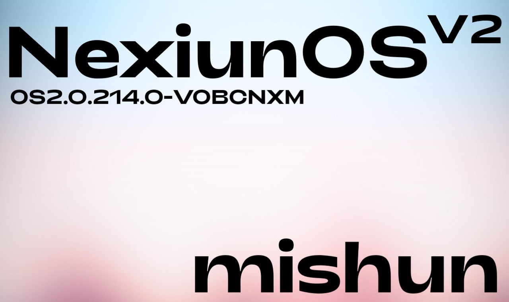

# Hyper NexiunOS V2
Hyper NexiunOS port for POCO X3 PRO (vayu)

## Info
- **Hyper NexiunOS V2**
- V2.0.214.0
- Port from POCO F3
- Android 15
- Updated: **27/08/25**
- Port by: [**xendr4x** (Project Eliminator)](https://t.me/project_eliminator)

## Download
- [Google Drive](https://drive.google.com/file/d/1Dr5HjsYwwylSde3zdSrjMrwFI8kLGIKd/view?usp=sharing)

## Bugs
- 60FPS After reboot
- Camera app is bad, should use gcam

## Notes
- OSS based
- GMS Included
- SELinux: Enforcing
- Play integrity: [Guide](https://t.me/HyperAliothPort/20)
- Bugs: if you found bugs, write bugs to [support group](https://t.me/pe_support)

## Contacts
- [Support Group](https://t.me/pe_support)
- [Channel](https://t.me/project_eliminator)

